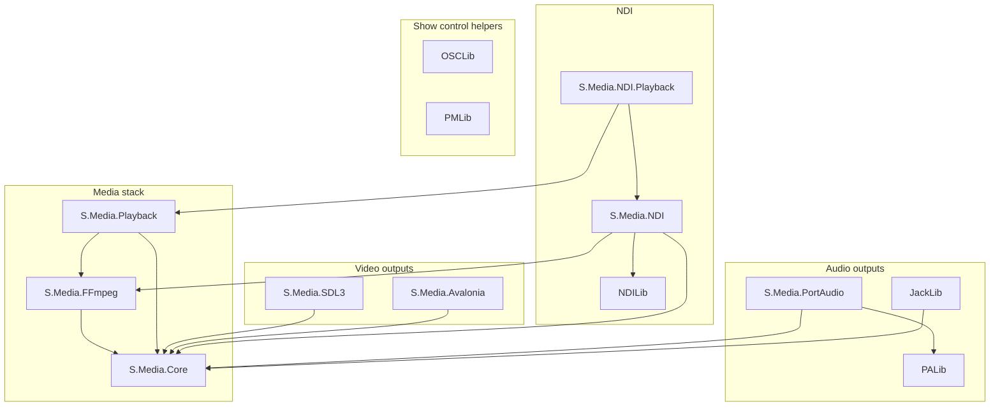

# MFPlayer framework libraries — reference

**Target framework:** `net10.0` (all projects in this document).  
**Package management:** Central versions in repository root `Directory.Packages.props`.

This document describes **library** projects you can reference when building media applications. It does **not** list sample executables under `MediaFramework/Test/`.

---

## 1. Dependency overview



`OSCLib` and `PMLib` depend only on logging abstractions; they do not reference `S.Media.Core`.

---

## 2. Quick catalogue

| Project | Path | Role |
|---------|------|------|
| **S.Media.Core** | `MediaFramework/Media/S.Media.Core` | Routing (`AVRouter`), media contracts, clocks, mixing helpers, `VideoFrameHandle`, endpoint interfaces |
| **S.Media.FFmpeg** | `MediaFramework/Media/S.Media.FFmpeg` | Demux/decode (`FFmpegDecoder`), `FFmpegAudioChannel` / `FFmpegVideoChannel` |
| **S.Media.Playback** | `MediaFramework/Media/S.Media.Playback` | `MediaPlayer`, `MediaPlayerBuilder` facade over Core + FFmpeg |
| **S.Media.PortAudio** | `MediaFramework/Audio/S.Media.PortAudio` | PortAudio-based audio endpoint (pull callback model) |
| **PALib** | `MediaFramework/Audio/PALib` | Low-level PortAudio interop / helpers used by `S.Media.PortAudio` |
| **JackLib** | `MediaFramework/Audio/JackLib` | JACK Audio Connection Kit interop (specialist deployments) |
| **S.Media.SDL3** | `MediaFramework/Video/S.Media.SDL3` | SDL3 + OpenGL video endpoint and clone sinks |
| **S.Media.Avalonia** | `MediaFramework/Video/S.Media.Avalonia` | Avalonia OpenGL video endpoint and clone controls |
| **NDILib** | `MediaFramework/NDI/NDILib` | Managed bindings / utilities for NDI native SDK |
| **S.Media.NDI** | `MediaFramework/NDI/S.Media.NDI` | NDI source/sink endpoints, clocks, discovery helpers (uses FFmpeg types where needed) |
| **S.Media.NDI.Playback** | `MediaFramework/NDI/S.Media.NDI.Playback` | Thin helpers for NDI-centric playback scenarios built on `MediaPlayer` + NDI |
| **OSCLib** | `MediaFramework/OSC/OSCLib` | OSC client/server, packet codec, address routing |
| **PMLib** | `MediaFramework/MIDI/PMLib` | PortMidi-based MIDI devices and message model |
| **MFPlayer.Framework.Publish** | `MediaFramework/Build/MFPlayer.Framework.Publish` | **Meta-project:** references all of the above for `dotnet publish` → `MediaFramework/FrameworkBuilds` (not a public API) |

---

## 3. S.Media.Core

**Assembly:** `S.Media.Core.dll`  
**NuGet:** `Microsoft.Extensions.Logging.Abstractions`

### Purpose

The **framework layer**: audio/video **routing** (`AVRouter`, `IAVRouter`), **endpoint** and **input** abstractions, **clocks**, **pixel format** utilities, **video frame** ownership (`VideoFrame`, `VideoFrameHandle`, `RefCountedVideoBuffer`), and **audio** primitives (`IAudioChannel`, `AudioFormat`, mixer helpers).

### Primary entry points

- **`S.Media.Core.Routing.AVRouter`** — Register inputs/endpoints, create routes, start/stop push threads, diagnostics.
- **`S.Media.Core.Routing.IAVRouter`** — Abstraction implemented by `AVRouter`.
- **`S.Media.Core.Media.Endpoints.IVideoEndpoint`** — Video sink contract; **`ReceiveFrame(in VideoFrameHandle)`** is the push delivery API.
- **`S.Media.Core.Media.Endpoints.IAudioEndpoint`**, **`IPullAudioEndpoint`**, **`IPullVideoEndpoint`** — Endpoint capability mix-ins.

### Documentation

- `Doc/Usage-Guide.md`, `Doc/Framework-Review-and-Multi-App-Feasibility.md`

---

## 4. S.Media.FFmpeg

**Assembly:** `S.Media.FFmpeg.dll`  
**NuGet:** `FFmpeg.AutoGen`, `Microsoft.Extensions.Logging.Abstractions`  
**Project reference:** `S.Media.Core`

### Purpose

File/container decode: **`FFmpegDecoder`** orchestrates demux and per-stream decode workers; exposes **`FFmpegAudioChannel`** and **`FFmpegVideoChannel`** as `IAudioChannel` / `IVideoChannel` for registration on **`AVRouter`**.

### Notes

- **Unsafe code** enabled (FFmpeg interop).
- **Hardware decode** options are controlled via **`FFmpegDecoderOptions`**.
- **FFmpeg native binaries** are **not** bundled; they must exist on the host OS (see consuming doc).

### Documentation

- `Doc/MediaPlayer-Guide.md` (via `MediaPlayer`), `Doc/Quick-Start.md`

---

## 5. S.Media.Playback

**Assembly:** `S.Media.Playback.dll`  
**Project references:** `S.Media.Core`, `S.Media.FFmpeg`

### Purpose

**Single-primary-file** playback facade: **`MediaPlayer`** (open/play/pause/stop, events) and **`MediaPlayerBuilder`**. Exposes **`IAVRouter Router`** for advanced graphs. Playlists and multi-asset policy belong in the host application.

### Documentation

- `Doc/MediaPlayer-Guide.md`, `Doc/Host-Application-Implementation-Checklist.md`

---

## 6. S.Media.PortAudio and PALib

**Assemblies:** `S.Media.PortAudio.dll`, `PALib.dll`  
**Project references:** `S.Media.PortAudio` → `S.Media.Core`, `PALib`

### Purpose

Real-time **audio output** through **PortAudio**. **`S.Media.PortAudio`** implements the endpoint types consumed by **`AVRouter`**; **`PALib`** holds lower-level interop.

### Runtime

PortAudio backend drivers must be available on the OS (ASIO/WASAPI/CoreAudio/etc., depending on build and platform).

---

## 7. JackLib

**Assembly:** `JackLib.dll`  
**Project reference:** `S.Media.Core`

### Purpose

**JACK** interop for specialist low-latency Linux/pro audio setups. Most desktop playback apps use **`S.Media.PortAudio`** instead.

---

## 8. S.Media.SDL3

**Assembly:** `S.Media.SDL3.dll`  
**NuGet:** `SDL3-CS`, `SDL3-CS.Native`, `Microsoft.Extensions.Logging.Abstractions`  
**Project reference:** `S.Media.Core`

### Purpose

**SDL3** window + **OpenGL** video presentation (**`SDL3VideoEndpoint`**), **clone** endpoints, vsync/render-loop integration. **Unsafe** code enabled.

### Runtime

Native SDL3 libraries are delivered via **`SDL3-CS.Native`** (`runtimes/` in publish output).

---

## 9. S.Media.Avalonia

**Assembly:** `S.Media.Avalonia.dll`  
**NuGet:** Avalonia stack (see `Directory.Packages.props`), Skia-related packages as required by the project file  
**Project reference:** `S.Media.Core`

### Purpose

**Avalonia** **OpenGL** video surface and **clone** controls for desktop UI apps.

### Runtime

Brings a **large** Avalonia dependency closure; include this project only when the host UI is Avalonia-based.

---

## 10. NDILib

**Assembly:** `NDILib.dll`

### Purpose

Managed layer for **NewTek NDI** (types, interop, utilities used by **`S.Media.NDI`**).

### Runtime

Requires **NDI SDK** / runtime components installed and licensing respected.

---

## 11. S.Media.NDI

**Assembly:** `S.Media.NDI.dll`  
**Project references:** `S.Media.Core`, `S.Media.FFmpeg`, `NDILib`

### Purpose

**NDI** as **source** and **sink**: send/receive audio–video, discovery/reconnect policies, **`NDIAVEndpoint`**, NDI-aligned clocks where applicable.

### Documentation

- `Doc/MediaPlayer-Guide.md` (NDI fan-out examples), `Doc/Clone-Sinks.md`

---

## 12. S.Media.NDI.Playback

**Assembly:** `S.Media.NDI.Playback.dll`  
**Project references:** `S.Media.Playback`, `S.Media.NDI`

### Purpose

Convenience composition for **file → NDI** style scenarios using **`MediaPlayer`** plus NDI endpoints. Not required if you wire **`AVRouter`** yourself.

---

## 13. OSCLib

**Assembly:** `OSCLib.dll`  
**NuGet:** `Microsoft.Extensions.Logging.Abstractions`

### Purpose

**Open Sound Control**: **`OSCServer`**, **`OSCClient`**, packet encode/decode, **`OSCRouter`** for address dispatch. Independent of the media graph; use from a cue engine or control service.

---

## 14. PMLib

**Assembly:** `PMLib.dll`  
**NuGet:** `Microsoft.Extensions.Logging.Abstractions`  
**Unsafe** code enabled (native PortMidi).

### Purpose

**MIDI** via **PortMidi**: device enumeration, input/output, structured message types. Map messages to application actions (for example cue triggers).

---

## 15. MFPlayer.Framework.Publish (build-only)

**Path:** `MediaFramework/Build/MFPlayer.Framework.Publish/MFPlayer.Framework.Publish.csproj`

References **all** libraries in sections 3–14 so that:

```bash
dotnet publish MediaFramework/Build/MFPlayer.Framework.Publish/MFPlayer.Framework.Publish.csproj -c Release -o MediaFramework/FrameworkBuilds/net10.0
```

produces one folder suitable for **binary reference** (see **`Consuming-Framework-Builds.md`**). The published **`MFPlayer.Framework.Publish.dll`** is removed automatically from that folder.

---

## 16. Related reading

| Topic | Location |
|-------|----------|
| Build script | `MediaFramework/Scripts/build-framework.sh`, `MediaFramework/Scripts/build-framework.ps1` |
| Output folder | `MediaFramework/FrameworkBuilds/README.md` |
| Host app checklist | `Doc/Host-Application-Implementation-Checklist.md` |
| Architecture review | `Doc/Framework-Review-and-Multi-App-Feasibility.md` |
